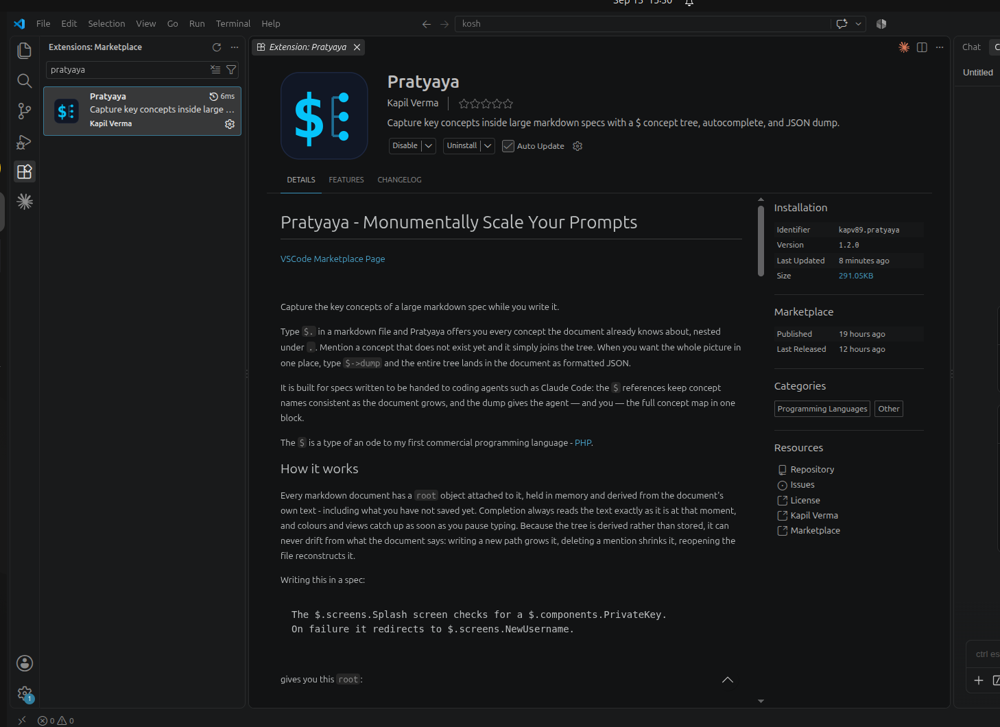
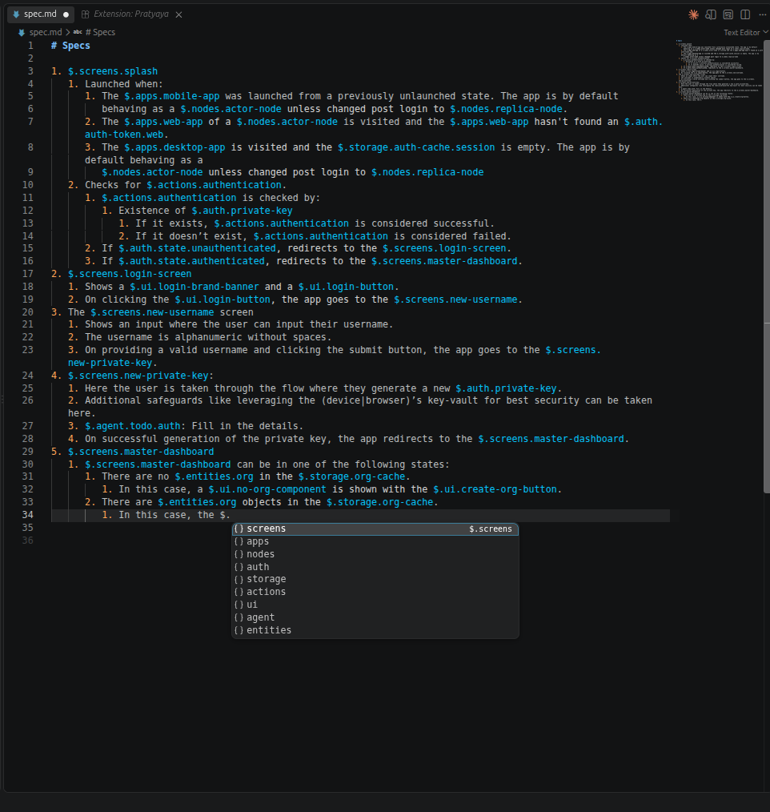

# Pratyaya - Monumentally Scale Your Prompts

[VSCode Marketplace Page](https://marketplace.visualstudio.com/items?itemName=kapv89.pratyaya)

Install inside VSCode:



Sample screenshot:



Capture the key concepts of a large markdown spec while you write it.

Pratyaya is built for specs written to be handed to coding agents such as Claude
Code. It adds three things to a markdown file, each typed inline and each
starting with `$`:

| You type | Feature | What it does |
| --- | --- | --- |
| `$.screens.Splash` | **The `$` tree** | References a concept. All the references in the document build one tree of concepts, and `$.` autocompletes from it. |
| `$->define.` | **Definitions** | Walks the tree to a concept and turns the line into a `#### $.screens.Splash` heading. The text under that heading becomes the concept's definition. |
| `$->dump` | **The dump** | Replaces itself with the whole tree, names, nesting and definitions included, as formatted JSON. |

References keep concept names consistent as the document grows. Definitions keep
what a concept means in the same document as the places it is used. The dump
puts the full concept map in one block, for the agent and for you.

The `$` is a type of an ode to my first commercial programming language - [PHP](https://www.php.net/).

## A quick tour

Write a spec as usual, putting `$` references where concepts come up. Here one
concept also gets a definition:

```markdown
The $.screens.Splash screen checks for an $.auth.token.
Without one it redirects to $.screens.NewUsername.

#### $.auth.token

The key a signed-in device holds, issued on $.screens.NewUsername.
---
```

Now type `$->dump` on an empty line and accept the suggestion. The expression is
replaced with:

```json
{
  "screens": {
    "($)": "screens",
    "Splash": {
      "($)": "Splash"
    },
    "NewUsername": {
      "($)": "NewUsername"
    }
  },
  "auth": {
    "($)": "auth",
    "token": {
      "($)": "token",
      "($->def)": "The key a signed-in device holds, issued on $.screens.NewUsername.\n"
    }
  }
}
```

You never declared the tree. It is read from the references. The `####` heading
was written by `$->define`, and nothing else is needed to attach the definition
to `auth.token`.

## How it works

Every markdown document has a `root` object attached to it, held in memory and
derived from the document's own text - including what you have not saved yet.
Completion always reads the text exactly as it is at that moment, and colours and
views catch up as soon as you pause typing. Because the tree is derived rather
than stored, it can never drift from what the document says: writing a new path
grows it, deleting a mention shrinks it, reopening the file reconstructs it.
Nothing is written to disk besides your markdown.

`$` opens a scope holding two things, side by side:

| Reached with | What it is |
| --- | --- |
| `$.` | **`root`** - the concept tree. Pure data: concepts and nothing else. |
| `$->` | **functions** - `define` and `dump`. |

A function is not a member of `root` and `root` is not a member of the functions.
Nothing reached through `->` can ever be written into the tree, show up in a dump,
or appear in the Concepts view. Because the two namespaces are separate, a
concept of your own may be called `dump` without colliding with the function:
`$.dump` is data, `$->dump` is the function.

A `$` only opens the scope once an accessor follows it. Every other dollar in a
spec - `$5`, `$100`, `$(pwd)`, `$x$` - is left alone: no suggestions, no
highlight, nothing in the tree.

## `$.` - the concept tree

### Writing references

A reference is `$` followed by one or more dot-separated names, each made of
`[A-Za-z0-9_-]`: `$.screens.Splash`, `$.auth.private-key`, `$.v2.api_token`.

- **Referencing a path creates every level of it.** `$.screens.Splash` puts
  `screens` at the top and `Splash` under it. The parent does not need a mention
  of its own.
- **Every occurrence counts.** Prose, lists, tables, headings and fenced code
  blocks all contribute to the tree.
- **Punctuation ends a reference.** In `redirects to $.screens.Login.` or
  `$.screens.Splash,` the reference is just the path, and the path is all that is
  coloured.
- **The tree follows the text.** Delete the last mention of a concept and it
  leaves the tree. To rename one, search and replace its path. There is no other
  copy to update.

### The shape of `root`

Writing this in a spec:

```
The $.screens.Splash screen checks for a $.components.PrivateKey.
On failure it redirects to $.screens.NewUsername.
```

gives you this `root`:

```json
{
  "screens": {
    "($)": "screens",
    "Splash": { "($)": "Splash" },
    "NewUsername": { "($)": "NewUsername" }
  },
  "components": {
    "($)": "components",
    "PrivateKey": { "($)": "PrivateKey" }
  }
}
```

Every node carries its own name under the `($)` key, and its children sit
alongside it, in the order they first appear in the document. The sigil you type
is short - `$` - while the object keeps the longer `($)` marker, so a dumped tree
stays readable on its own.

If you process the tree with a script, the rule is simple. **Keys in parentheses
are metadata about the node itself:** `($)` is its name, and `($->def)`, when
present, is its definition, written with `$->define`. **Every other key is a child
concept, and its value is always an object.**

### Completion

| You type | You get |
| --- | --- |
| `$.` | the top-level concepts — `screens`, `components` |
| `$.screens.` | that node's children — `Splash`, `NewUsername` |
| `$.screens.S` | `Splash` only — filtering is by prefix, case-insensitive |
| `$.screens.Payments` | nothing to suggest; the new concept is added to the tree |
| `$.nothing.` | nothing - `nothing` is not in the tree yet |
| `$->` | the scope's functions - `define` (at the start of a line only), `dump` |

Suggestions keep document order rather than sorting alphabetically, so the list
reads the way the spec does. Branch concepts show a module icon, leaves a field
icon, and the details pane previews the subtree under the concept, definitions
included.

## `$->define` - definitions

A reference says *where* a concept is used. A definition says *what it is*, in
the same document as everything else.

### The walk

Type `$->define.` at the start of a line (indentation is fine). The walk offers
the concepts you already have, one level at a time:

| You type | You get |
| --- | --- |
| `$->define.` | the top-level concepts |
| `$->define.au` | concepts starting with `au` |
| `$->define.auth` | `()` to define `auth`, and `.` because it has children |
| `$->define.auth.` | the children of `auth` |
| `$->define.auth.token` | `()` alone - `token` is a leaf |

Picking a concept or `.` opens the next level straight away, so you can walk the
whole way with the suggestion widget. Anywhere other than the start of a line,
`$->` does not offer `define`.

The walk only offers what is still undefined. A concept that already has a
definition - even an empty one - is left out, unless something beneath it has
none yet. Then it stays, so you can walk through it, but without `()`.

Choosing `()` ends the walk and replaces the whole line with a heading:

```
#### $.auth.token
```

### Writing the heading yourself

The walk only reaches concepts that are already in the tree. The heading is
plain markdown, so you can also type it directly. A heading is a concept
reference like any other, which means `#### $.billing.Invoice` also declares
`billing.Invoice`. You can define a concept before you first use it.

For a line to count as a definition heading it must be exactly `####`, a space,
and one path, with nothing else on the line, outside any fenced code block.
`#### $.auth.token (v2)`, `### $.auth.token`, an indented heading or one shown
inside a code fence are still references, but they do not start a definition.

### What the definition contains

Everything under the heading is the definition. It stops at the first of these,
outside a fenced code block:

- a line that begins with `---`
- a line that begins with one to four `#` - any heading up to `####`, the next
  definition included
- the end of the document

Lines inside a fenced code block are code, not markdown, so a `# comment` in a
shell snippet or a `---` in YAML stays in the definition. A fence opens with
three or more backticks or tildes, indented or not, so fences inside list items
count. It closes on a line of the same character that is at least as long, or
runs to the end of the document if it is never closed.

For headings inside a definition, use `#####` and `######`, which do not end it.

A single blank line either side is left out: the one you write after the heading,
and the final newline of a document. Everything else, including markdown and
further `$` references, is kept verbatim.

The definition lands on the concept itself, under `($->def)`, beside the name:

```json
{
  "auth": {
    "($)": "auth",
    "token": { "($)": "token", "($->def)": "The key a signed-in device holds.\n" }
  }
}
```

So definitions travel with the tree. You will find them in every `$->dump`, in
the live JSON view, in a concept's tooltip in the Concepts view, and in the
completion details pane. If you write two definitions for one concept, the last
one wins.

Definition headings are coloured whole, in the concept colour, once their path
resolves in the tree.

## `$->dump` - the tree as JSON

Type `$->dump` anywhere in a line and accept the suggestion. The expression is
removed and `root` takes its place, as JSON indented by two spaces. By default
the JSON is wrapped in a fenced `json` block. Turn `pratyaya.dumpAsCodeBlock` off
for bare JSON.

- **It is built when you accept it,** not when the suggestion list opened. It
  reflects the document as it is at that moment, unsaved text included.
- **It is the whole tree.** Names, nesting and every `($->def)` definition are
  there. There is no subtree dump: `$->dump.screens` is an invalid expression.
- **It is a snapshot.** The block is ordinary text and does not update as the
  spec changes. To refresh one, select the old block and run
  **Pratyaya: Dump concept tree at cursor**, which replaces every selection with
  a fresh dump. To see the tree stay current without writing anything into the
  document, run **Pratyaya: Show live concept tree** instead.

Typical uses: paste the dump at the top of a prompt so an agent sees every
concept before reading the spec, or keep one at the end of a spec you hand over
whole. The [shape of `root`](#the-shape-of-root) section describes the JSON for
anything that consumes it.

## The invalid state

Once `$.` or `$->` has been typed, anything that is not a well formed expression
puts it into the invalid state: `$.\.*$`, `$..`, `$.a.b/c`, `$->dump.screens`.
Completion stops and the list collapses to a single red, struck-through `invalid`
entry. That entry can never be applied; accepting it inserts nothing at all and
tells you why.

Punctuation that closes a sentence (`$.screens.Splash,`) is read as prose, not
as a malformed expression, so completion just stops there.

## Views and commands

- **Concepts** view, in the Explorer sidebar (collapsed by default). It shows the
  tree of the markdown document you are editing, and keeps showing it when focus
  moves to a non-markdown editor. The title shows the concept count and each
  branch shows its number of children. Hover a concept for its path and JSON,
  definition included. Its inline button inserts that concept's `$.` reference at
  the cursor. The button in the view's title bar opens the live view.
- **Pratyaya: Show live concept tree** — opens `root` as read-only JSON beside
  the document. It re-renders when you pause typing, and the spec is untouched.
- **Pratyaya: Dump concept tree at cursor** — the `$->dump` output without typing
  the expression. It is inserted at every cursor and replaces every selection.

## Settings

| Setting | Default | Meaning |
| --- | --- | --- |
| `pratyaya.enabledLanguages` | `["markdown"]` | Language ids where `$` is active. |
| `pratyaya.dumpAsCodeBlock` | `true` | Wrap dumped JSON in a fenced `json` block. |
| `pratyaya.highlightConcepts` | `true` | Colour `$` expressions in the editor. |
| `pratyaya.conceptColor.dark` | `#05c3f9` | Concept colour on dark themes. |
| `pratyaya.conceptColor.light` | `#800c0c` | Concept colour on light themes. |

Colour changes take effect immediately - no reload.

Markdown ships with quick suggestions turned off, so the widget opens on the
trigger characters `.`, `-` and `>` — which is exactly when you want it. To
have it also open as you type a concept name, add:

```json
"[markdown]": {
  "editor.quickSuggestions": { "other": "on" }
}
```

## Performance

Pratyaya is built for large specs. Nothing is recomputed while you type: the
document is analysed once typing pauses, and colours and views are touched only
when what they show has actually changed - which, for ordinary prose, it has not.

Measured inside VS Code on a generated, well structured spec - nested headings, a
concept reference every 25 words or so, definitions throughout (1,921 references
and 168 definitions at 50,000 words) - on an i7-1360P with VS Code 1.137:

| median / p95 | 50,000 words | 100,000 words |
| --- | --- | --- |
| Keystroke, Pratyaya switched off | 0.9 / 7.3 ms | 1.2 / 36.3 ms |
| Keystroke, Pratyaya on, views closed | 0.5 / 2.7 ms | 0.6 / 6.5 ms |
| Keystroke, Pratyaya on, sidebar and live view open | 0.6 / 4.3 ms | 0.9 / 4.8 ms |
| Completion | 0.4-1.5 / 6-12 ms | 0.5-1.1 / 9-18 ms |

With Pratyaya on, typing is no slower than with it off; the differences between
those rows are run-to-run noise. The slowest completion seen was 71 ms, for the
first request after an edit to the 100,000-word document.

To reproduce, `npm run bench:editor` runs the same measurements in a fresh VS Code,
and `PRATYAYA_BENCH_WORDS=100000 npm run bench:editor` changes the document size.

## Development

```bash
npm install
npm test               # core unit tests (no editor needed)
npm run test:integration   # drives a real VS Code instance
npm run test:all
npm run bench          # core timings on a generated 50,000-word spec
npm run bench:editor   # the same spec in a real VS Code
npx vsce package       # builds pratyaya-<version>.vsix
```

Press <kbd>F5</kbd> to open an Extension Development Host on `examples/`.

The concept tree lives in [`src/concepts.ts`](src/concepts.ts) as pure functions
with no VS Code imports — parsing, tree building, definitions, filtering and
dumping are all unit tested in [`test/concepts.test.ts`](test/concepts.test.ts).
[`src/store.ts`](src/store.ts) keeps a live analysis of each document, redone
only when typing pauses or completion needs it,
[`src/highlight.ts`](src/highlight.ts) colours the expressions,
[`src/views.ts`](src/views.ts) draws the sidebar and the live JSON view, and
[`src/extension.ts`](src/extension.ts) is the editor glue.

The scope's functions are the `SCOPE_FUNCTIONS` registry in `concepts.ts`, and
adding an entry there is enough for it to be offered after `$->`. An entry takes
one of two forms:

- **`render`** replaces its own expression with text. `dump` works this way.
- **`path`** walks `root` first, and its `call` rewrites the line once `()` is
  chosen. `define` works this way. Its `accepts` decides which concepts get `()`,
  and a concept that is not accepted is still walked through when something
  beneath it is.

`lineStart: true` keeps a function to the start of a line.

[`test/integration/live.test.ts`](test/integration/live.test.ts) runs inside a
real VS Code instance against a buffer that is never saved, so it pins down the
behaviour that matters most: suggestions, the live view and the dump all reflect
text typed a moment ago, with no save in between.

## Releasing

Tagging a version publishes it. `.github/workflows/release.yml` runs both test
suites, packages the extension, pushes it to the VS Code Marketplace and Open VSX,
and attaches the `.vsix` to a GitHub release:

```bash
npm version patch      # or minor / major - commits and tags
git push --follow-tags
```

The tag must match `package.json`; the workflow checks and fails early if it does
not. It needs two repository secrets, under Settings - Secrets and variables -
Actions:

| Secret | Where it comes from | Required |
| --- | --- | --- |
| `VSCE_PAT` | Azure DevOps personal access token, scope Marketplace - Manage, organization "All accessible organizations" | yes |
| `OVSX_PAT` | Open VSX access token from open-vsx.org | no - the step is skipped without it |

`.github/workflows/ci.yml` runs the same suites on every push and pull request.

## License

MIT
