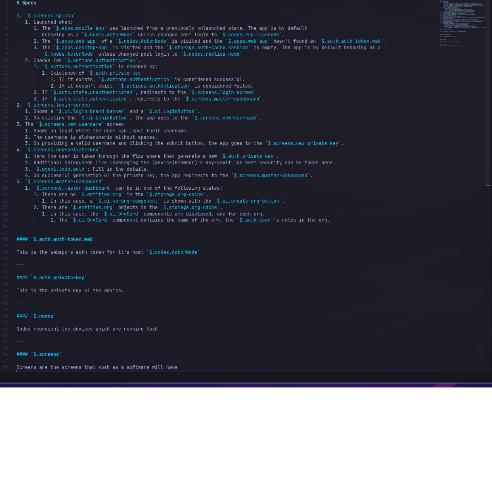

# Pratyaya - Monumentally Scale Your Prompts

A spec is only as good as its nouns. Write fifty pages for a coding agent and the
same idea turns up as `LoginButton`, as `login-button`, and as "the login CTA" -
and the agent builds three of them. Pratyaya makes every concept something you
reference rather than retype: type `` `$. `` and the names already in the document
complete themselves, so a spec's vocabulary holds still while the spec keeps
growing. When one file stops being enough, point Pratyaya at the folder: the
whole set shares a single vocabulary, so a concept defined in `auth.md` completes
in `screens.md`, and renaming it moves every mention in every file at once. Those
references build a concept tree as you write, any concept can carry its definition
beside the places it is used, and the whole map drops into your prompt as JSON -
so the agent starts from your vocabulary instead of inventing one.

[VSCode Marketplace Page](https://marketplace.visualstudio.com/items?itemName=kapv89.pratyaya)

Install inside VSCode:


Sample screenshot:



Capture the key concepts of a large markdown spec while you write it.

Pratyaya is built for specs written to be handed to coding agents such as Claude
Code. It adds three things to a markdown file. Each is typed inline as inline
code, starting with a backtick and a `$`:

| You type | Feature | What it does |
| --- | --- | --- |
| `` `$.screens.Splash` `` | **The `$` tree** | References a concept. All the references in the document build one tree of concepts, and `` `$. `` autocompletes from it. |
| `` `$->define. `` | **Definitions** | Walks the tree to a concept and turns the line into a `` #### `$.screens.Splash` `` heading. The text under that heading becomes the concept's definition. |
| `` `$->dump `` | **The dump** | Replaces itself with the whole tree, names, nesting and definitions included, as formatted JSON. |

References keep concept names consistent as the document grows. Definitions keep
what a concept means in the same document as the places it is used. The dump
puts the full concept map in one block, for the agent and for you.

The `$` is a type of an ode to my first commercial programming language - [PHP](https://www.php.net/).

## Why backticks

Markdown previews with maths support, VS Code's included, read two `$` signs on
one line as a formula. A spec full of bare `$.screens.Splash` references renders
as run-together italic maths. Inside inline code a `$` is just a character, so
`` `$.screens.Splash` `` previews as what it is: a name in code font.

Documents written for Pratyaya 1.x use bare references. See
[Upgrading from 1.x](#upgrading-from-1x) to convert them in one step.

## A quick tour

Write a spec as usual, putting references where concepts come up. Here one
concept also gets a definition:

```markdown
The `$.screens.Splash` screen checks for an `$.auth.token`.
Without one it redirects to `$.screens.NewUsername`.

#### `$.auth.token`

The key a signed-in device holds, issued on `$.screens.NewUsername`.
---
```

Now type `` `$->dump `` on an empty line and accept the suggestion. The expression
is replaced with:

```json
{
  "screens": {
    "($)": "screens",
    "Splash": {
      "($)": "Splash"
    },
    "NewUsername": {
      "($)": "NewUsername"
    }
  },
  "auth": {
    "($)": "auth",
    "token": {
      "($)": "token",
      "($->def)": "The key a signed-in device holds, issued on `$.screens.NewUsername`.\n"
    }
  }
}
```

You never declared the tree. It is read from the references. The `####` heading
was written by `$->define`, and nothing else is needed to attach the definition
to `auth.token`.

## How it works

Every markdown document has a `root` object attached to it, held in memory and
derived from the document's own text - including what you have not saved yet.
Completion always reads the text exactly as it is at that moment, and colours and
views catch up as soon as you pause typing. Because the tree is derived rather
than stored, it can never drift from what the document says: writing a new path
grows it, deleting a mention shrinks it, reopening the file reconstructs it.
Nothing is written to disk besides your markdown. A spec that has outgrown one
file can share a single tree across several - see
[Several files, one tree](#several-files-one-tree).

`$` opens a scope holding two things, side by side:

| Reached with | What it is |
| --- | --- |
| `` `$. `` | **`root`** - the concept tree. Pure data: concepts and nothing else. |
| `` `$-> `` | **functions** - `define` and `dump`. |

A function is not a member of `root` and `root` is not a member of the functions.
Nothing reached through `->` can ever be written into the tree, show up in a dump,
or appear in the Concepts view. Because the two namespaces are separate, a
concept of your own may be called `dump` without colliding with the function:
`` `$.dump` `` is data, `` `$->dump` `` is the function.

A `$` only opens the scope straight after a backtick and before an accessor. Every
other dollar in a spec - `$5`, `$100`, `$(pwd)`, `$x$`, and a bare `$.a.b` - is
left alone: no suggestions, no highlight, nothing in the tree.

## `` `$. `` - the concept tree

### Writing references

A reference is inline code holding `$` and one or more dot-separated names, each
made of `[A-Za-z0-9_-]`: `` `$.screens.Splash` ``, `` `$.auth.private-key` ``,
`` `$.v2.api_token` ``.

- **Referencing a path creates every level of it.** `` `$.screens.Splash` `` puts
  `screens` at the top and `Splash` under it. The parent does not need a mention
  of its own.
- **Every occurrence counts.** Prose, lists, tables, headings and fenced code
  blocks all contribute to the tree.
- **The code span is the reference, exactly.** It opens with a single backtick
  right before the `$` and closes with one right after the last name.
  `` `see $.screens.Splash` `` is code that mentions a path, not a reference, and
  `` `$.screens.Splash `` without its closing backtick is not in the tree yet.
- **The tree follows the text.** Delete the last mention of a concept and it
  leaves the tree. To rename one, [rename it](#renaming-a-concept) and every
  reference follows. There is no other copy to update.

### The shape of `root`

Writing this in a spec:

```markdown
The `$.screens.Splash` screen checks for a `$.components.PrivateKey`.
On failure it redirects to `$.screens.NewUsername`.
```

gives you this `root`:

```json
{
  "screens": {
    "($)": "screens",
    "Splash": { "($)": "Splash" },
    "NewUsername": { "($)": "NewUsername" }
  },
  "components": {
    "($)": "components",
    "PrivateKey": { "($)": "PrivateKey" }
  }
}
```

Every node carries its own name under the `($)` key, and its children sit
alongside it, in the order they first appear in the document. The sigil you type
is short - `$` - while the object keeps the longer `($)` marker, so a dumped tree
stays readable on its own.

If you process the tree with a script, the rule is simple. **Keys in parentheses
are metadata about the node itself:** `($)` is its name, and `($->def)`, when
present, is its definition, written with `$->define`. **Every other key is a child
concept, and its value is always an object.**

### Completion

Type a backtick, then `$`, then `.` or `->`. Markdown does not close backticks for
you, so type the closing one once you have picked the concept.

| You type | You get |
| --- | --- |
| `` `$. `` | the top-level concepts — `screens`, `components` |
| `` `$.screens. `` | that node's children — `Splash`, `NewUsername` |
| `` `$.screens.S `` | `Splash` only — filtering is by prefix, case-insensitive |
| `` `$.screens.Payments` `` | nothing to suggest; the new concept is added to the tree |
| `` `$.nothing. `` | nothing - `nothing` is not in the tree yet |
| `` `$-> `` | the scope's functions - `define` (at the start of a line only), `dump` |

Suggestions keep document order rather than sorting alphabetically, so the list
reads the way the spec does. Branch concepts show a module icon, leaves a field
icon, and the details pane previews the subtree under the concept, definitions
included.

### Renaming a concept

Put the cursor on any name in a reference and press <kbd>F2</kbd>. You can also
right-click a concept in the Concepts view and choose **Rename concept…**, or
select it there and press <kbd>F2</kbd>. The concept is renamed across the
document in one edit, and a single undo reverts it.

Renaming `Splash` in `` `$.screens.Splash` `` to `Launch`:

| Before | After |
| --- | --- |
| `` `$.screens.Splash` `` | `` `$.screens.Launch` `` |
| `` `$.screens.Splash.logo` `` | `` `$.screens.Launch.logo` `` - children move with it |
| `` #### `$.screens.Splash` `` | `` #### `$.screens.Launch` `` - the definition stays attached |
| `` `$.other.Splash` `` | unchanged - a different concept |
| `` `$.screens.SplashV2` `` | unchanged - a different name |

- **Every reference that builds the tree is renamed.** That includes definition
  headings, references inside definitions, and references inside fenced code
  blocks.
- **Any name in the path can be renamed.** Renaming `screens` moves every screen.
- **The new name follows the usual rule:** letters, digits, `_` and `-`.
  Anything else is refused and the document is left alone.
- **Renaming onto a name that already exists beside it merges the two**, once you
  confirm. Their references become one concept and their children combine. If
  both have a definition, both headings stay and the one later in the document
  wins.
- **A dump already in the document is a snapshot.** Its JSON keys keep the old
  name until you dump again.

## `` `$->define `` - definitions

A reference says *where* a concept is used. A definition says *what it is*, in
the same document as everything else.

### The walk

Type `` `$->define. `` at the start of a line (indentation is fine). The walk
offers the concepts you already have, one level at a time:

| You type | You get |
| --- | --- |
| `` `$->define. `` | the top-level concepts |
| `` `$->define.au `` | concepts starting with `au` |
| `` `$->define.auth `` | `()` to define `auth`, and `.` because it has children |
| `` `$->define.auth. `` | the children of `auth` |
| `` `$->define.auth.token `` | `()` alone - `token` is a leaf |

Picking a concept or `.` opens the next level straight away, so you can walk the
whole way with the suggestion widget. Anywhere other than the start of a line,
`` `$-> `` does not offer `define`.

The walk only offers what is still undefined. A concept that already has a
definition - even an empty one - is left out, unless something beneath it has
none yet. Then it stays, so you can walk through it, but without `()`.

Choosing `()` ends the walk and replaces the whole line with a heading:

```markdown
#### `$.auth.token`
```

### Writing the heading yourself

The walk only reaches concepts that are already in the tree. The heading is
plain markdown, so you can also type it directly. A heading is a concept
reference like any other, which means `` #### `$.billing.Invoice` `` also
declares `billing.Invoice`. You can define a concept before you first use it.

For a line to count as a definition heading it must be exactly `####`, a space,
and one reference in backticks, with nothing else on the line, outside any fenced
code block. `` #### `$.auth.token` (v2) ``, `` ### `$.auth.token` ``, an indented
heading or one shown inside a code fence are still references, but they do not
start a definition.

### What the definition contains

Everything under the heading is the definition. It stops at the first of these,
outside a fenced code block:

- a line that begins with `---`
- a line that begins with one to four `#` - any heading up to `####`, the next
  definition included
- the end of the document

Lines inside a fenced code block are code, not markdown, so a `# comment` in a
shell snippet or a `---` in YAML stays in the definition. A fence opens with
three or more backticks or tildes, indented or not, so fences inside list items
count. It closes on a line of the same character that is at least as long, or
runs to the end of the document if it is never closed.

For headings inside a definition, use `#####` and `######`, which do not end it.

A single blank line either side is left out: the one you write after the heading,
and the final newline of a document. Everything else, including markdown and
further references, is kept verbatim.

The definition lands on the concept itself, under `($->def)`, beside the name:

```json
{
  "auth": {
    "($)": "auth",
    "token": { "($)": "token", "($->def)": "The key a signed-in device holds.\n" }
  }
}
```

So definitions travel with the tree. You will find them in every dump, in the
live JSON view, in a concept's tooltip in the Concepts view, and in the
completion details pane. If you write two definitions for one concept, the last
one wins.

Definition headings are coloured whole, in the concept colour, once their path
resolves in the tree.

### Concepts you have not defined yet

Every concept starts undefined: it exists because you referenced it. Pratyaya
marks the ones that never got a definition, so the gap between what a spec names
and what it explains is visible while you write, rather than when an agent reads
it back to you.

Each undefined concept is reported **once**, on its own name in the first
reference that reaches it. A spec mentions its concepts constantly, and what is
worth seeing is which ones are still undefined, not how often each was written.
The Problems panel (<kbd>Ctrl</kbd>+<kbd>Shift</kbd>+<kbd>M</kbd>) then reads as
the list of concepts left to pin down:

```text
`$.screens.Splash` is referenced but never defined.
Type `$->define.screens.Splash` at the start of a line to define it.
```

Because referencing a path creates every level of it, a parent is reported apart
from its children. Given `` `$.auth.token` `` and a definition for `token` alone,
`auth` is reported and `token` is not.

This is [the walk](#the-walk) seen from the other side: what `$->define` still
offers is exactly what gets reported, and defining a concept clears it as soon as
you pause typing. References inside fenced code blocks count here too, because
they count for the tree.

### Writing the definition from the report

The lightbulb on a reported concept - <kbd>Ctrl</kbd>+<kbd>.</kbd> on it, or the
quick fix on its entry in the Problems panel - offers
**Define `` `$.a.b` ``**. It writes the heading, puts the cursor on the empty line
under it, and leaves you to type.

The heading joins the definitions the spec already keeps, rather than landing
beside the reference:

1. Look for the first definition that has not already ended by the reference.
2. If there is none, the heading goes at the end of the section the reference
   sits in - before the next heading of level 1 to 4, or at the end of the
   document.
3. Otherwise follow that run of definitions for as long as one is parted from the
   next by nothing but blank lines and `---` rules, and write the heading after
   the last of them.

So a spec that gathers its definitions into a block at the foot grows that block,
in the order the concepts come up. A `---` is written before the new heading only
where the document already closes its definitions that way, and never one after
it: every landing point is already a line that ends a definition, so the empty
body cannot run on into what follows.

`pratyaya.undefinedConcepts` sets how loud this is: `information` by default, a
faint underline in the editor; `hint` for the faintest marking VS Code has;
`warning` for a yellow squiggle and a count in the status bar; or `off`.

## `` `$->dump `` - the tree as JSON

Type `` `$->dump `` anywhere in a line and accept the suggestion. The expression
is removed, along with a closing backtick if you had already typed one, and
`root` takes its place, as JSON indented by two spaces. By default the JSON is
wrapped in a fenced `json` block. Turn `pratyaya.dumpAsCodeBlock` off for bare
JSON.

- **It is built when you accept it,** not when the suggestion list opened. It
  reflects the document as it is at that moment, unsaved text included.
- **It is the whole tree.** Names, nesting and every `($->def)` definition are
  there. There is no subtree dump: `` `$->dump.screens `` is an invalid
  expression.
- **It is a snapshot.** The block is ordinary text and does not update as the
  spec changes. To refresh one, select the old block and run
  **Pratyaya: Dump concept tree at cursor**, which replaces every selection with
  a fresh dump. To see the tree stay current without writing anything into the
  document, run **Pratyaya: Show live concept tree** instead.

Typical uses: paste the dump at the top of a prompt so an agent sees every
concept before reading the spec, or keep one at the end of a spec you hand over
whole. The [shape of `root`](#the-shape-of-root) section describes the JSON for
anything that consumes it.

## Several files, one tree

A spec outgrows one file long before it outgrows one set of concepts. Point
`pratyaya.roots` at the files that belong together and they share a single
`root`:

```json
"pratyaya.roots": ["spec/**/*.md"]
```

That belongs in the workspace's `.vscode/settings.json`. The globs are read
relative to the workspace folder, and keeping the setting beside the spec means
anyone who opens the repo gets the same root without configuring anything. The
same pattern in your personal settings would form a root in every project you
open that happens to have a `spec` folder. In a multi-root workspace it goes in
the `.code-workspace` file: the setting is window-scoped, so one list covers every
folder and a single folder's own settings are ignored.

A reference written in any of them then completes, resolves, renames and dumps
against the concepts of all of them:

| | |
| --- | --- |
| **Completion** | `` `$. `` in `spec/screens.md` offers concepts first written in `spec/auth.md`. |
| **Definitions** | A `` #### `$.auth.token` `` heading in one file defines that concept for every file. |
| **Undefined concepts** | A concept is only [reported](#concepts-you-have-not-defined-yet) when no file in the root defines it. |
| **Renaming** | <kbd>F2</kbd> renames the concept in every file of the root, open in an editor or not, in one undoable edit. |
| **The dump** | `` `$->dump `` writes the whole root, so one block still holds every concept in the spec. The Concepts view and the live JSON view show the whole root too. |

**Each pattern is a root of its own.** Two specs in one repo stay apart by
getting a pattern each, and a file matched by two patterns joins the first.
To gather several globs into *one* root, write them as one pattern:

```json
"pratyaya.roots": ["{spec/**/*.md,shared/glossary.md}", "rfcs/**/*.md"]
```

**With no patterns set, nothing is shared** and every document keeps the tree of
its own text, exactly as before. A file that matches no pattern does the same.

### How the files are read

Members are found once, in the background, when Pratyaya wakes, and a watcher
keeps up with them afterwards - a file saved in another window, or changed by a
branch switch, reaches the tree without reopening anything.

- **An open editor always wins over the copy on disk.** A concept typed into one
  file a moment ago is offered in another with nothing saved in between, which is
  how Pratyaya has always treated the file you are editing.
- **Files are merged in path order**, so the tree reads the same however you got
  there. Concepts keep the order they were first seen, and where two files define
  the same concept the later one wins - the rule a single document already
  follows for two definitions.
- **A file with no `$` references contributes nothing**, so a README or a
  changelog caught by a broad pattern cannot put anything in the tree.
  `node_modules` is never scanned, and what a root costs to assemble and keep
  current is [measured](#performance).

## The invalid state

Once `` `$. `` or `` `$-> `` has been typed, anything that is not a well formed
expression puts it into the invalid state: `` `$.\.*$ ``, `` `$.. ``,
`` `$.a.b/c ``, `` `$->dump.screens ``. Completion stops and the list collapses
to a single red, struck-through `invalid` entry. That entry can never be applied;
accepting it inserts nothing at all and tells you why.

The closing backtick ends an expression, and so does punctuation that closes a
sentence before it (`` `$.screens.Splash, ``). Either way completion just stops
there.

## Upgrading from 1.x

Pratyaya 1.x read bare references - `$.screens.Splash`, `#### $.auth.token`,
`$->dump`. Pratyaya 2 reads only the backticked form, so a 1.x spec has an empty
tree until it is upgraded.

When you open a markdown file that still has bare expressions, Pratyaya offers to
upgrade it:

- **Upgrade** wraps each one in backticks: `$.screens.Splash` becomes
  `` `$.screens.Splash` `` and `#### $.auth.token` becomes
  `` #### `$.auth.token` ``. It is a single edit, so one undo reverts it, and the
  file is left unsaved for you to review.
- **Never ask again** turns the offer off by setting `pratyaya.offerUpgrade` to
  `false`. Set it back to `true` to see it again.
- Dismissing the notification leaves the file alone. It is not offered again for
  that file until VS Code restarts.

**Pratyaya: Upgrade old-style concept expressions** in the Command Palette
(<kbd>Ctrl</kbd>+<kbd>Shift</kbd>+<kbd>P</kbd>) does the same for the active file
at any time, whatever the setting.

Only prose is upgraded. Fenced code blocks and inline code are left exactly as
they are: they never broke the preview, and a `$.store.book` there is as likely
to be JSONPath as a concept. A reference that only ever appeared in code drops out
of the tree; wrap it by hand if you want it back. A bare expression touching a
stray backtick is also left for you to fix.

## Views and commands

- **Concepts** view, in the Explorer sidebar (collapsed by default). It shows the
  tree of the markdown document you are editing, and keeps showing it when focus
  moves to a non-markdown editor. The title shows the concept count and each
  branch shows its number of children. Hover a concept for its path and JSON,
  definition included. Its inline button inserts that concept's reference at
  the cursor. Right-click a concept, or select it and press <kbd>F2</kbd>, to
  [rename it](#renaming-a-concept). The button in the view's title bar opens the
  live view.
- **Pratyaya: Show live concept tree** — opens `root` as read-only JSON beside
  the document. It re-renders when you pause typing, and the spec is untouched.
- **Pratyaya: Dump concept tree at cursor** — the `` `$->dump `` output without
  typing the expression. It is inserted at every cursor and replaces every
  selection.
- **Pratyaya: Upgrade old-style concept expressions** — wraps a 1.x document's
  bare expressions in backticks. See [Upgrading from 1.x](#upgrading-from-1x).

## Settings

| Setting | Default | Meaning |
| --- | --- | --- |
| `pratyaya.enabledLanguages` | `["markdown"]` | Language ids where `$` is active. |
| `pratyaya.roots` | `[]` | Globs whose files [share one concept tree](#several-files-one-tree). Each pattern is a root of its own. |
| `pratyaya.dumpAsCodeBlock` | `true` | Wrap dumped JSON in a fenced `json` block. |
| `pratyaya.highlightConcepts` | `true` | Colour `$` expressions in the editor. |
| `pratyaya.undefinedConcepts` | `"information"` | How to report a concept that is referenced but never defined: `information`, `hint`, `warning`, `off`. |
| `pratyaya.conceptColor.dark` | `#05c3f9` | Concept colour on dark themes. |
| `pratyaya.conceptColor.light` | `#800c0c` | Concept colour on light themes. |
| `pratyaya.offerUpgrade` | `true` | Offer to upgrade 1.x expressions when a file that has them is opened. |

Colour changes take effect immediately - no reload.

Markdown ships with quick suggestions turned off, so the widget opens on the
trigger characters `.`, `-` and `>` — which is exactly when you want it. To
have it also open as you type a concept name, add:

```json
"[markdown]": {
  "editor.quickSuggestions": { "other": "on" }
}
```

## Performance

Pratyaya is built for large specs. Nothing is recomputed while you type: the
document is analysed once typing pauses, and colours and views are touched only
when what they show has actually changed - which, for ordinary prose, it has not.

Measured inside VS Code on a generated, well structured spec - nested headings, a
concept reference every 25 words or so, definitions throughout (1,921 references
and 168 definitions at 50,000 words) - on an i7-1360P with VS Code 1.137:

| median / p95 | 50,000 words | 100,000 words |
| --- | --- | --- |
| Keystroke, Pratyaya switched off | 0.9 / 7.3 ms | 1.2 / 36.3 ms |
| Keystroke, Pratyaya on, views closed | 0.5 / 2.7 ms | 0.6 / 6.5 ms |
| Keystroke, Pratyaya on, sidebar and live view open | 0.6 / 4.3 ms | 0.9 / 4.8 ms |
| Completion | 0.4-1.5 / 6-12 ms | 0.5-1.1 / 9-18 ms |

With Pratyaya on, typing is no slower than with it off; the differences between
those rows are run-to-run noise. The slowest completion seen was 71 ms, for the
first request after an edit to the 100,000-word document.

Reporting undefined concepts is the one piece of work that scales with the whole
document rather than with what changed: about 1.7 ms on the 50,000-word spec,
beside the 1.6 ms the tree itself costs. It runs once typing pauses, never on the
keystroke path, and not at all with `pratyaya.undefinedConcepts` set to `off`.

**A root costs less per keystroke than one file of the same size.** Each member's
tree is cached on its own, so a change to one file rebuilds that file and merges
the root again. On the same 50,000-word spec split across ten files that is
0.5 ms, against 1.6 ms to rebuild it as a single document — most of a spec is not
the file you are typing in. Merging ten cached trees is 0.3 ms of that, and
assembling the root from cold, which the scan does once, is 2.0 ms on top of
reading the files off disk.

Splitting the same words further barely moves it: at forty files the merge is
0.4 ms, a cold assembly 2.5 ms, and a keystroke still 0.5 ms. It is the words
that cost, not the files. What the scan itself spends on I/O depends on your disk
and how wide the pattern is, and is paid once, in the background.
`npm run bench 50000 40` measures all three for a given word count and file count.

To reproduce, `npm run bench:editor` runs the same measurements in a fresh VS Code,
and `PRATYAYA_BENCH_WORDS=100000 npm run bench:editor` changes the document size.

## Development

```bash
npm install
npm test               # core unit tests (no editor needed)
npm run test:integration   # drives a real VS Code instance
npm run test:all
npm run bench          # core timings on a generated 50,000-word spec
npm run bench 50000 40 # the same words as a root of 40 files
npm run bench:editor   # the same spec in a real VS Code
npx vsce package       # builds pratyaya-<version>.vsix
```

Press <kbd>F5</kbd> to open an Extension Development Host on `examples/`.

The concept tree lives in [`src/concepts.ts`](src/concepts.ts) as pure functions
with no VS Code imports — parsing, tree building, definitions, filtering and
dumping are all unit tested in [`test/concepts.test.ts`](test/concepts.test.ts).
[`src/legacy.ts`](src/legacy.ts) finds 1.x expressions, also without VS Code,
tested in [`test/legacy.test.ts`](test/legacy.test.ts).
[`src/store.ts`](src/store.ts) keeps a live analysis of each document, redone
only when typing pauses or completion needs it,
[`src/roots.ts`](src/roots.ts) gathers the files that share one tree and keeps
them current,
[`src/highlight.ts`](src/highlight.ts) colours the expressions,
[`src/rename.ts`](src/rename.ts) renames a concept from <kbd>F2</kbd> or the
sidebar,
[`src/diagnostics.ts`](src/diagnostics.ts) reports the concepts that have no
definition and writes one on request,
[`src/upgrade.ts`](src/upgrade.ts) offers and runs the 1.x upgrade,
[`src/views.ts`](src/views.ts) draws the sidebar and the live JSON view, and
[`src/extension.ts`](src/extension.ts) is the editor glue.

The scope's functions are the `SCOPE_FUNCTIONS` registry in `concepts.ts`, and
adding an entry there is enough for it to be offered after `` `$-> ``. An entry
takes one of two forms:

- **`render`** replaces its own expression with text. `dump` works this way.
- **`path`** walks `root` first, and its `call` rewrites the line once `()` is
  chosen. `define` works this way. Its `accepts` decides which concepts get `()`,
  and a concept that is not accepted is still walked through when something
  beneath it is.

`lineStart: true` keeps a function to the start of a line.

[`test/integration/live.test.ts`](test/integration/live.test.ts) runs inside a
real VS Code instance against a buffer that is never saved, so it pins down the
behaviour that matters most: suggestions, the live view and the dump all reflect
text typed a moment ago, with no save in between.

## Releasing

Tagging a version publishes it. `.github/workflows/release.yml` runs both test
suites, packages the extension, pushes it to the VS Code Marketplace and Open VSX,
and attaches the `.vsix` to a GitHub release:

```bash
npm version patch      # or minor / major - commits and tags
git push --follow-tags
```

The tag must match `package.json`; the workflow checks and fails early if it does
not. It needs two repository secrets, under Settings - Secrets and variables -
Actions:

| Secret | Where it comes from | Required |
| --- | --- | --- |
| `VSCE_PAT` | Azure DevOps personal access token, scope Marketplace - Manage, organization "All accessible organizations" | yes |
| `OVSX_PAT` | Open VSX access token from open-vsx.org | no - the step is skipped without it |

`.github/workflows/ci.yml` runs the same suites on every push and pull request.

## License

MIT
